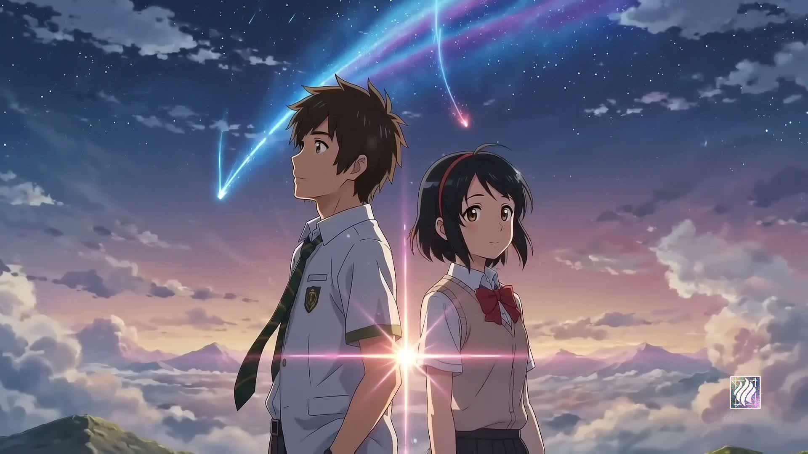
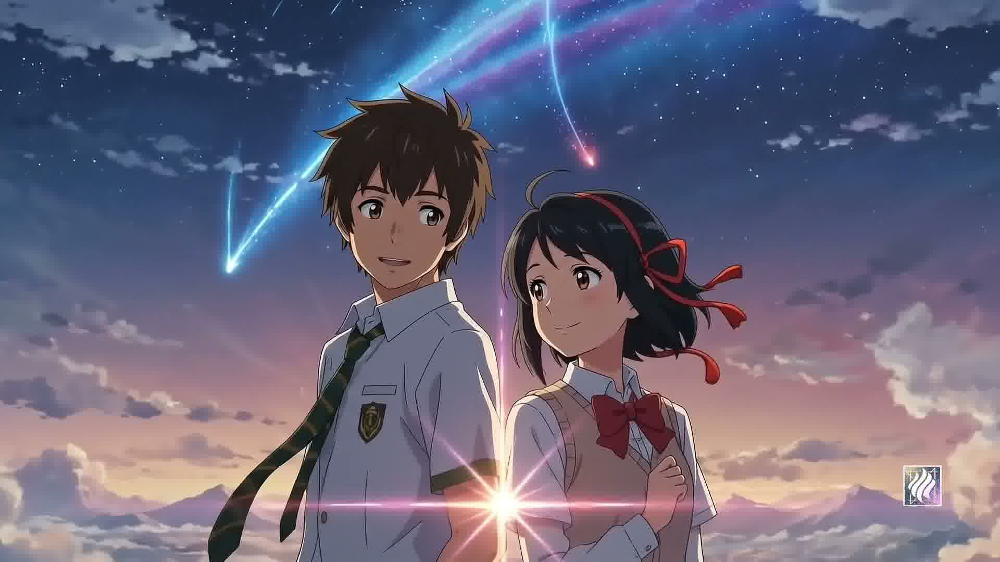

# 君の名は。| Your Name — Interactive Scroll Experience

<div align="center">
  
  
  <br/>
  <br/>

  [](https://halde.github.io/your-name-scroll-experience)
  [](LICENSE)
  [](https://vitejs.dev/)
  [](https://developer.mozilla.org/en-US/docs/Web/API/Canvas_API)
  [](https://developer.mozilla.org/en-US/docs/Web/API/Web_Audio_API)
</div>

---

## ✨ Overview

An immersive, **scroll-driven interactive landing page** built as a tribute to Makoto Shinkai's masterpiece *"Your Name" (君の名は。)*. This project scrubs through **106 high-quality cinematic frames** from the film using smooth linear interpolation (lerping), synchronized with typography animations and a real-time reactive audio visualizer.

Every scroll position maps to a precise frame, creating a breathtaking cinematic experience directly in the browser — no video files, no plugins, just pure HTML5 Canvas and JavaScript.

---

## 🎬 Features

| Feature | Description |
|---|---|
| 🎞️ **Scroll-Scrubbed Canvas Animation** | 106 cinematic frames driven directly by scroll position with lerp-based inertia momentum |
| 📐 **Responsive Object-Fit Scaling** | Canvas dynamically resizes to cover any landscape/portrait ratio without stretching |
| 🪟 **Glassmorphic UI** | Glass overlay badges, transparent navigation bars, and glowing borders |
| 🎵 **Synced Lyrics Player** | A dedicated section displaying custom lyrics for *"Memory's Shadow"* |
| 📊 **Real-time Audio Visualizer** | Connects to the lo-fi track, extracts frequency data, and draws responsive visualizer waves |
| 💓 **Pulsing Lyrics Beat** | Active lyric stanzas dynamically glow and breathe in sync with average sound volume |
| 🌙 **Cinematic Dark Mode** | Full dark-mode design with gradient overlays and sky backgrounds |

---

## 🖥️ Live Demo

> 🔗 **[View Live on GitHub Pages →](https://halde.github.io/your-name-scroll-experience)**

Scroll through the page to scrub through the film frames. Use the music player at the bottom to play *"Memory's Shadow"* and watch the visualizer come alive.

---

## 🛠️ Tech Stack

- **HTML5 Canvas API** — Frame-by-frame animation rendering
- **Web Audio API** — Real-time frequency analysis and audio visualization
- **CSS Glassmorphism** — Frosted glass effects, backdrop-filter blur
- **Vite** — Lightning-fast development and bundling
- **Vanilla JavaScript** — Zero dependencies for animation logic (pure `requestAnimationFrame`)
- **Google Fonts (Outfit, Noto Serif JP)** — Typography inspired by the film's aesthetics

---

## 🚀 Getting Started

### Prerequisites

- [Node.js](https://nodejs.org/) v16 or higher
- npm (bundled with Node.js)

### Installation

```bash
# 1. Clone the repository
git clone https://github.com/halde/your-name-scroll-experience.git

# 2. Navigate into the project
cd your-name-scroll-experience

# 3. Install dependencies
npm install

# 4. Start the development server
npm run dev
```

Then open [http://localhost:5173](http://localhost:5173) in your browser.

### Build for Production

```bash
npm run build
```

The output will be in the `dist/` folder, ready to deploy anywhere.

---

## 📁 Project Structure

```
your-name-scroll-experience/
├── index.html              # Main HTML shell (canvas, audio, lyric sections)
├── app.js                  # Core animation engine (preloader, lerp loop, audio visualizer)
├── style.css               # Glassmorphism design system, animations, typography
├── memory-shadow.m4a       # Original lo-fi background track — "Memory's Shadow"
├── sky-background.png      # Sky gradient overlay for cinematic atmosphere
├── ezgif-frame-001.jpg     # 
│   ...                     #  106 cinematic frame sequence from Your Name
│   ezgif-frame-106.jpg     # 
├── package.json            # Project metadata and scripts
└── README.md               # This file
```

---

## 🌐 Deploying to GitHub Pages

1. Create a new **public** repository on GitHub.
2. Push this project to the `main` branch.
3. Go to **Settings → Pages** in your repository.
4. Under **Build and deployment**, choose:
   - Source: **Deploy from a branch**
   - Branch: `main`, folder: `/ (root)`
5. Save — your site will be live in about a minute at `https://<username>.github.io/<repo-name>/`.

> **Note**: Since this is a static site with no build step required (Vite is only used for local dev), the raw source files can be served directly by GitHub Pages without a CI/CD pipeline.

---

## 🎨 Design Highlights

- **Lerp Interpolation** (`LERP_FACTOR = 0.08`) creates smooth, cinematic inertia as you scroll
- **Object-fit: cover** math ensures frames always fill the screen regardless of aspect ratio
- **Web Audio API** pipeline: `MediaElementSource → AnalyserNode → Destination` for zero-latency visualization
- **CSS `backdrop-filter: blur()`** for glass panels with browser fallbacks
- **`requestAnimationFrame`** loop for buttery-smooth 60fps rendering

---

## 📸 Screenshots

<div align="center">
  
  
</div>

---

## 🙏 Credits & Acknowledgments

- **Film**: *君の名は。(Your Name)* — Directed by **Makoto Shinkai**, produced by CoMix Wave Films (2016)
- **Music**: *"Memory's Shadow"* — Original lo-fi composition included in this project
- **Inspiration**: The comet scene, body-swapping narrative, and breathtaking cinematography of Shinkai's work

> ⚠️ **Disclaimer**: This project is a **fan-made tribute** created for educational and artistic purposes. All cinematic frames are the intellectual property of CoMix Wave Films / Toho Co., Ltd. This project is not affiliated with, endorsed by, or officially connected to the film or its creators.

---

## 📄 License

This project (code only) is licensed under the [MIT License](LICENSE).
The film frames and music belong to their respective copyright holders.

---

<div align="center">
  <sub>Made with 💙 for 君の名は。</sub>
</div>
